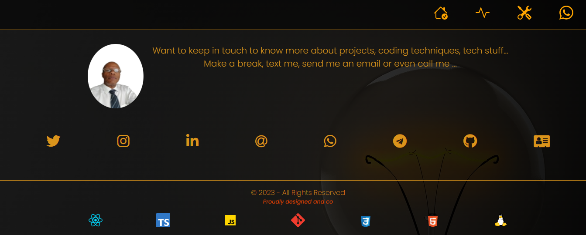

## Professional Web Page - @Ricardo Ferreira
This is a real attempt to show my career development as a software engineer, facing a lot of different projects, most of which turned out to be very successful products and helped companies I worked for increase their profitability and productivity. Here are some of the technologies I have dealt with
- ReactJS, HTML, CSS & JavaScript
- Java & Spring Boot & Maven
- PHP, MySQL & Apache/Nginx
- MongoDB
- Zabbix & Nagios
- ElasticSearch, Prometheus, Grafana 
- Jenkins & SonarQube
- Drivers for SCSI mass storage devices
- Networking, DNS, Firewall
- OpenBSD & FreeBSD & Linux
- etc...
## _Table of contents_
- [Professional Web Page - @Ricardo Ferreira](#professional-web-page---ricardo-ferreira)
- [_Table of contents_](#table-of-contents)
- [_Overview_](#overview)
- [_Screenshot_](#screenshot)
- [_Links_](#links)
- [_Built with_](#built-with)
- [_What I practiced_](#what-i-practiced)
- [_Continued development_](#continued-development)
  - [_Useful resources_](#useful-resources)
- [_Author_](#author)
- [Acknowledgments](#acknowledgments)
## _Overview_
These web pages were coded using ReactJS exploring hooks such as useState, useLocation, useEffect:
- src|
    - App.tsx
    - assets|
    - components|
      - Contact
      - Footer
      - Header
      - Project
      - Skill
      - welcome
    - routes
      - Contacts
      - Feet
      - Home
      - Intro
      - Projects
      - Skills
    - utils
   - App.tsx
   - index.css
   - main.tsx
   - index.html
   - tsconfig.json
   - tsconfig.node.json
   - vite.config.js
   - yarn.lock
- public|

## _Screenshot_
[]()
## _Links_
- Live Site URL: [https://www.ferreiras.dev.br] 
## _Built with_

[](https://skillicons.dev)


 ## _What I practiced_
```jsx
import React from "react";
import Contacts from "./routes/Contacts"
import Home from "./routes/Home"
import Projects from "./routes/Projects";
import Skills from "./routes/Skills";
import Background from "./routes/Background";                                                                                                                                                                                                                                                                                                                                                                                                                                                                                                                                                                                                                                                                                                                                                                                                                                                                                                                                                                                                                                                                                                                                                                                                                                                                                                                                                                                                                                                                                                                                                                                                                                                                                                                                                                                                                                                                                                                                                                                                                                                                                                                                                                                                                                                                                                                                                                                                                                                                                                                                                                                                                                                                                                                                                                                                                                                                                                                                                                                                                                                                                                                                                import { BrowserRouter, Route, Routes } from 'react-router-dom';
import ScrollToTop from './utils/ScrollToTop';
import Wakatime from "./routes/Wakatime";

export default function App() {

  const MemoizedProjects = React.memo(Projects);
  const MemoizedSkills = React.memo(Skills);
  const MemoizedHome = React.memo(Home);
  const MemoizedContacts = React.memo(Contacts);
  const MemoizedHistory = React.memo(Background);
  const MemoizedWakatime = React.memo(Wakatime);

  return (
    <BrowserRouter>
        <ScrollToTop />
        <Routes>
          <Route path="/" element={<MemoizedHome />}> </Route>
          <Route index element={<MemoizedHome />}></Route>
          <Route path="contacts" element={<MemoizedContacts />}></Route>
          <Route path="skills" element={<MemoizedSkills />}></Route>
          <Route path="projects" element={<MemoizedProjects />}></Route>
          <Route path="history" element={<MemoizedHistory />}></Route>
          <Route path="wakatime" element={<MemoizedWakatime />}></Route>
        </Routes>  

      </BrowserRouter>
  )
}
``` 

## _Continued development_
- Next step: Show diplomas, certificates and achievements using an animaited carrousel.
### _Useful resources_
- [https://reactjs.org] React lets you build user interfaces out of individual pieces called components!.
- [https://yarnpkg.org/] Open-source package manager used to manage dependencies in  JavaScript.
- [https://vitejs.dev/guide/] Build tool that aims to provide a faster and leaner development experience for modern web projects.
## _Author_
- Website - [https://ferreiras.dev.br] 
## Acknowledgments
- 
